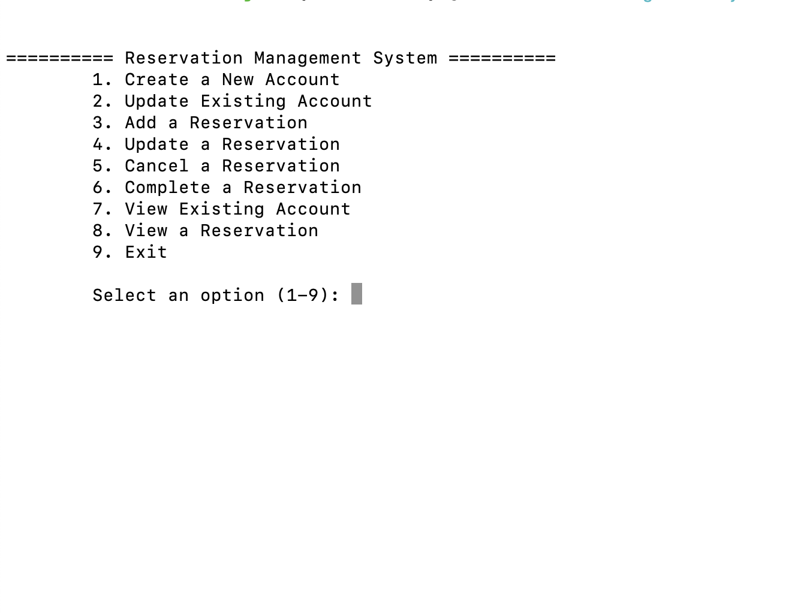
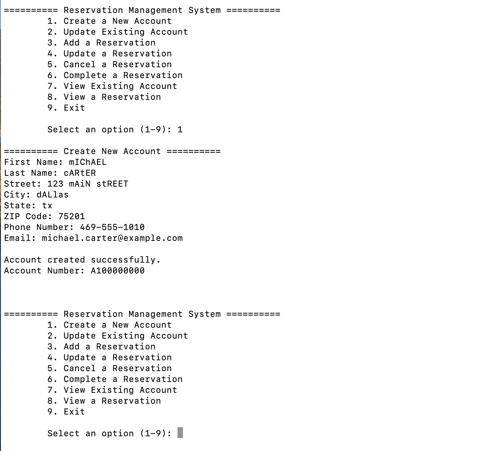
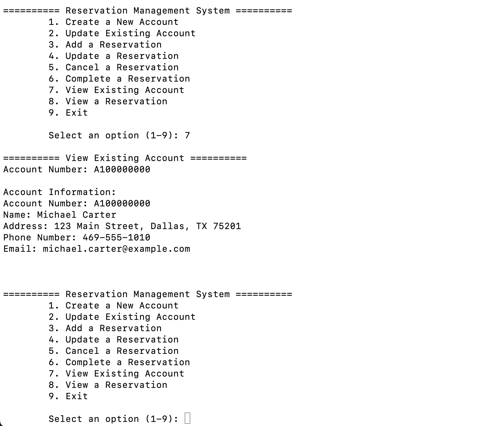
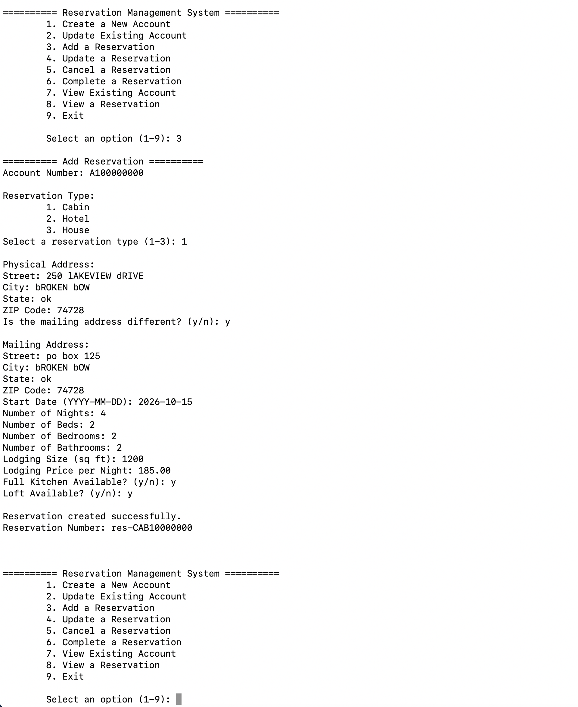
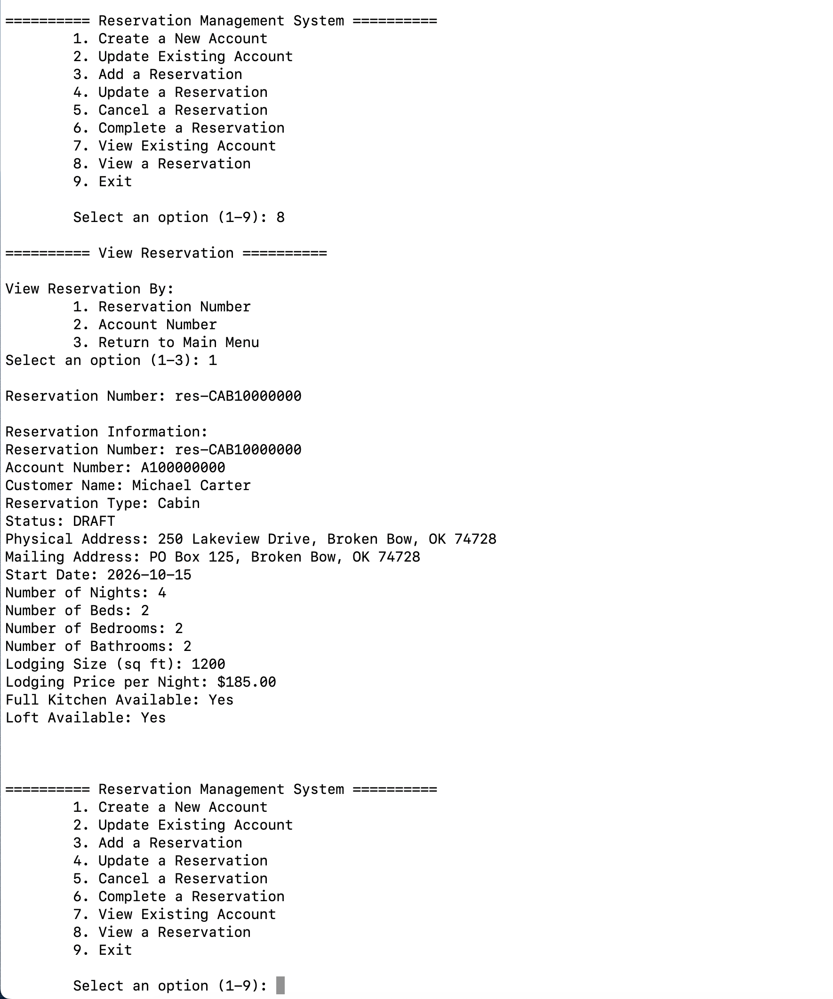
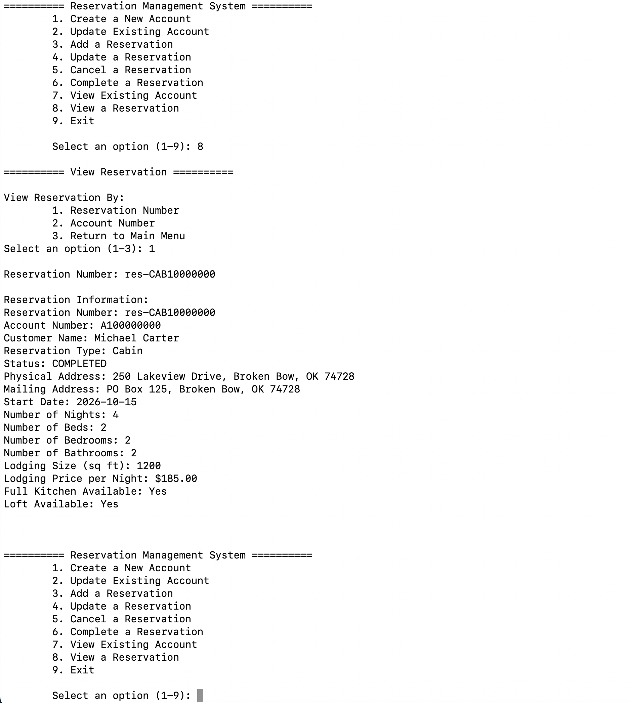

# Reservation Management System

## Overview

The Reservation Management System is a Java command-line application for managing customer accounts and lodging reservations.

The project demonstrates backend-focused Java development through object-oriented design, inheritance and polymorphism, input validation, reservation lifecycle management, file-based persistence, custom exception handling, and automated testing.

The system supports three lodging types—cabins, hotels, and houses—each with shared reservation behavior and type-specific attributes and pricing rules.

---

## Features

- Create, update, and view customer accounts
- Store and display normalized customer names
- Normalize street and city capitalization for consistent address data
- Create and update lodging reservations
- View reservations directly by reservation number
- Browse reservations associated with an account
- Support Cabin, Hotel, and House reservation types
- Calculate lodging prices using reservation-specific pricing rules
- Complete and cancel reservations through controlled lifecycle transitions
- Prevent modification of completed or cancelled reservations
- Validate account, name, address, contact, and reservation data
- Persist accounts and reservations using structured text files
- Reload persisted application data between executions
- Handle invalid operations with custom exception types
- Verify domain and application behavior with JUnit tests

---

## Application Preview

The command-line interface provides account management, reservation management, lookup, and reservation lifecycle operations.

### Main Menu



### Create Account

Customer accounts include a normalized first and last name, mailing address, phone number, and email address.



### View Existing Account

Account information can be retrieved using the generated account number. Names and addresses are displayed using normalized capitalization.



### Create Reservation

Reservations are associated with an existing customer account. The example below creates a Cabin reservation with separate physical and mailing addresses.



### Reservation Details

Reservation details include the associated customer, reservation status, lodging information, addresses, dates, pricing information, and type-specific attributes.



### Reservation Lifecycle

Reservations begin in the `DRAFT` state and may transition to `COMPLETED` or `CANCELLED`. Completed and cancelled reservations are protected against further modification.



---

## Reservation Types

The application models lodging through an abstract `Reservation` base class with specialized reservation types.

### Cabin

Cabin reservations include:

- Full-kitchen availability
- Loft availability
- Cabin-specific pricing behavior

### Hotel

Hotel reservations include:

- Kitchenette availability
- Hotel-specific pricing behavior

### House

House reservations include:

- Number of floors
- House-specific pricing behavior

Shared reservation information includes:

- Reservation number
- Associated account
- Reservation status
- Physical address
- Mailing address
- Start date
- Number of nights
- Number of beds
- Number of bedrooms
- Number of bathrooms
- Lodging size
- Lodging price

This design uses inheritance and polymorphism to share common reservation behavior while allowing each lodging type to maintain specialized data and logic.

---

## Reservation Lifecycle

Reservations use a controlled lifecycle.

```text
DRAFT ──────> COMPLETED
  │
  └─────────> CANCELLED
```

New reservations begin in the `DRAFT` state.

A draft reservation may be updated, completed, or cancelled. Once a reservation becomes `COMPLETED` or `CANCELLED`, it is locked against further modification.

Lifecycle rules are enforced by the application rather than relying solely on the command-line interface.

---

## Architecture

The application separates command-line interaction, application coordination, domain behavior, and persistence responsibilities.

### `ReservationMenu`

Provides the command-line user interface.

It is responsible for:

- Displaying application menus
- Collecting user input
- Re-prompting for invalid field input
- Displaying account and reservation information
- Requesting confirmation for lifecycle operations

### `Manager`

Coordinates application-level operations and persisted accounts.

Responsibilities include:

- Loading persisted accounts when the application starts
- Managing the collection of accounts
- Locating accounts and reservations
- Generating identifiers
- Coordinating persistence operations

### `Account`

Represents a customer account and manages its associated reservations.

Responsibilities include:

- Customer identity and contact information
- Reservation ownership
- Adding reservations
- Updating reservations
- Reservation retrieval
- Coordinating reservation persistence

### `Name`

Represents a customer's first and last name.

Name values are validated and normalized when created. Each name component is converted to consistent title-style capitalization while valid internal hyphens and apostrophes are preserved.

Examples include:

```text
jAMES             -> James
sANTIAGO-mARTINEZ -> Santiago-Martinez
o'bRIEN           -> O'Brien
```

### `Address`

Represents a physical or mailing address.

Street and city values are normalized for consistent display while state abbreviations are stored in uppercase. Address normalization preserves numbers, spaces, hyphens, and apostrophes and handles the standard `PO Box` abbreviation.

Examples include:

```text
123 mAIn sTreet -> 123 Main Street
bROKEN bOW      -> Broken Bow
po box 125      -> PO Box 125
tx              -> TX
```

### `Reservation`

The abstract base class for lodging reservations.

It contains shared reservation state, validation, pricing behavior, lifecycle rules, and update behavior used by the concrete reservation types.

### Reservation Subclasses

The application provides three concrete implementations:

```text
Reservation
├── CabinReservation
├── HotelReservation
└── HouseReservation
```

Each subtype extends the shared reservation model with lodging-specific properties and behavior.

### Supporting Types

Additional application components include:

- `Address`
- `Name`
- `ReservationStatus`
- Custom exception types for validation, persistence, duplicate objects, invalid operations, and missing domain objects

---

## Persistence

The application uses structured text files for local persistence rather than a database.

Runtime data is stored under:

```text
data/
```

Accounts are stored in account-specific directories, with reservation information persisted alongside the associated account data.

Persisted account records include the account number, customer name, mailing address, phone number, and email address.

Persisted data is loaded when the application starts, allowing accounts and reservations to survive between application executions.

The runtime `data/` directory is excluded from Git so local application data is not committed to the repository.

### Custom Data Directory

The default persistence location can be overridden using the `RMS_DATA_DIR` Java system property.

Example:

```bash
java -DRMS_DATA_DIR="/absolute/path/to/data" \
     -cp target/classes \
     com.jamesstevens.rms.Main
```

This is useful for testing or maintaining separate datasets.

---

## Project Structure

```text
reservation-management-system/
├── docs/
│   └── screenshots/
│       ├── create-account.png
│       ├── create-reservation.png
│       ├── find-account.png
│       ├── main-menu.png
│       ├── reservation-details.png
│       └── reservation-lifecycle.png
├── src/
│   ├── main/
│   │   └── java/
│   │       └── com/jamesstevens/rms/
│   │           ├── Main.java
│   │           ├── ReservationMenu.java
│   │           ├── Manager.java
│   │           ├── Account.java
│   │           ├── Address.java
│   │           ├── Name.java
│   │           ├── enums/
│   │           │   └── ReservationStatus.java
│   │           ├── exceptions/
│   │           └── reservation/
│   │               ├── Reservation.java
│   │               ├── CabinReservation.java
│   │               ├── HotelReservation.java
│   │               └── HouseReservation.java
│   └── test/
│       └── java/
│           └── com/jamesstevens/rms/tests/
│               ├── AccountTest.java
│               ├── AddressTest.java
│               ├── FindAccountTest.java
│               ├── FindReservationTest.java
│               ├── NameTest.java
│               └── ReservationTest.java
├── .gitignore
├── LICENSE
├── pom.xml
└── README.md
```

Generated build output, IDE configuration, and runtime application data are excluded from version control.

---

## Getting Started

### Prerequisites

Install:

- Java 17 or later
- Apache Maven 3.8 or later
- Git

Verify Java:

```bash
java -version
```

Verify Maven:

```bash
mvn -version
```

---

### Clone the Repository

```bash
git clone https://github.com/jas812000/reservation-management-system.git
cd reservation-management-system
```

---

### Build and Test

Run a clean build and execute the automated test suite:

```bash
mvn clean test
```

A successful build should finish with:

```text
BUILD SUCCESS
```

---

### Run the Application

After compiling the project:

```bash
mvn compile
```

Launch the command-line application:

```bash
java -cp target/classes com.jamesstevens.rms.Main
```

The main menu provides the following operations:

```text
========== Reservation Management System ==========
    1. Create a New Account
    2. Update Existing Account
    3. Add a Reservation
    4. Update a Reservation
    5. Cancel a Reservation
    6. Complete a Reservation
    7. View Existing Account
    8. View a Reservation
    9. Exit
```

---

## Using the CLI

### Accounts

The application allows users to:

- Create an account
- Update an existing account
- View an existing account

Account information includes the account number, customer name, mailing address, phone number, and email address.

Customer names are represented by the `Name` value object and normalized when an account is created or loaded.

Address values are also normalized to provide consistent street, city, state, and `PO Box` formatting.

### Reservations

Reservations can be added to an existing account and updated while they remain in the `DRAFT` state.

The application supports:

- Cabin reservations
- Hotel reservations
- House reservations

Each reservation belongs to an account. When reservation details are displayed, the associated customer's name is retrieved from that account rather than duplicated in the reservation itself.

### Viewing Reservations

A reservation can be viewed in two ways.

**Reservation Number**

Enter a reservation number to display the complete reservation directly.

**Account Number**

Enter an account number to display a compact list containing:

```text
Reservation Number | Type | Start Date | Status
```

A reservation can then be selected from that account for full details.

### Completing and Cancelling

Before completing or cancelling a reservation, the application displays the reservation and requests confirmation.

Completed and cancelled reservations remain available for viewing but cannot be modified.

---

## Validation and Error Handling

Validation is enforced throughout the domain and application layers.

Examples include:

- Required values
- Customer name validation
- Name capitalization and normalization
- Address validation
- Address capitalization and normalization
- State and ZIP code validation
- Phone-number validation
- Email validation
- Numeric reservation values
- Reservation dates
- Duplicate objects
- Missing accounts or reservations
- Invalid lifecycle operations
- Persistence load/save failures

The project defines custom exception types for these failure categories so invalid operations can be handled explicitly and consistently.

---

## Testing

Automated tests are implemented with JUnit 5.

The current test suite contains six test classes:

- `AccountTest`
- `AddressTest`
- `FindAccountTest`
- `FindReservationTest`
- `NameTest`
- `ReservationTest`

The suite currently contains **66 automated tests** covering account behavior, name validation and normalization, address validation and normalization, reservation behavior, lookup operations, persistence, lifecycle rules, and related application logic.

Run all tests with:

```bash
mvn clean test
```

A successful test run should report:

```text
Tests run: 66, Failures: 0, Errors: 0, Skipped: 0
BUILD SUCCESS
```

In addition to automated testing, the command-line workflows have been manually verified for account management, reservation creation and updates, account and reservation lookup, lifecycle transitions, validation behavior, and persistence across application restarts.

---

## Technologies

- Java 17
- Maven
- JUnit 5
- Java object-oriented programming
- File-based persistence
- Command-line interface
- Git / GitHub

---

## Future Improvements

The current application intentionally uses a lightweight Java and file-persistence architecture. Potential extensions include:

- **Relational database persistence** — Replace structured text storage with PostgreSQL or another relational database using JDBC or JPA.
- **REST API** — Expose account and reservation functionality through a Spring Boot REST API.
- **Authentication and authorization** — Add authenticated users and role-based access to administrative and reservation operations.
- **Availability management** — Track lodging inventory and prevent reservations that conflict with existing bookings.
- **Structured logging** — Introduce an application logging framework for operational and diagnostic events.
- **Executable application packaging** — Package the application as an executable JAR for simpler distribution and startup.

---

## Purpose

This project demonstrates practical Java software-engineering concepts including:

- Object-oriented design
- Abstraction, inheritance, and polymorphism
- Encapsulation of domain rules
- Value-object modeling
- Input and state validation
- Data normalization
- Controlled object lifecycle transitions
- File persistence
- Error handling with custom exception types
- Defensive handling of application state
- Automated testing with JUnit
- Maven project organization and builds
- Git-based source control

It serves as a focused example of building and testing a stateful Java application without relying on a web framework or database.

---

## License

This project is licensed under the MIT License.

See [LICENSE](LICENSE) for details.
